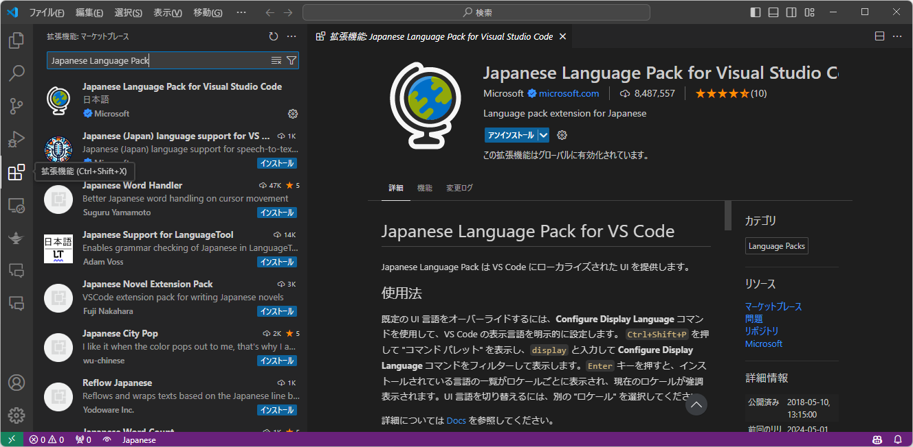
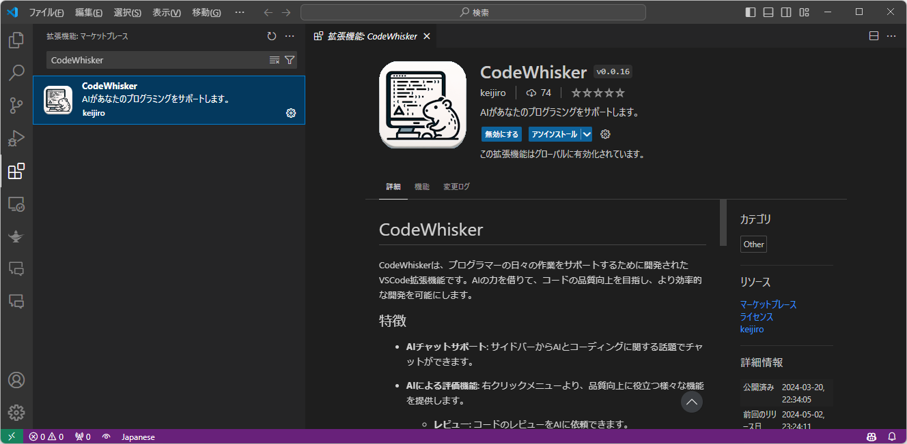
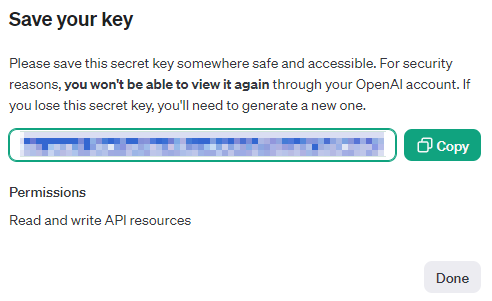
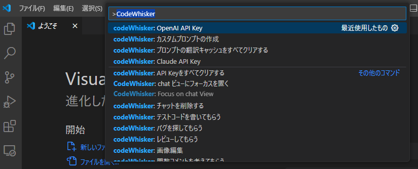
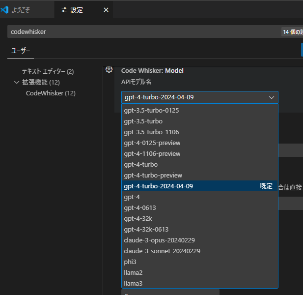
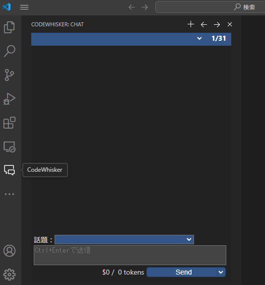
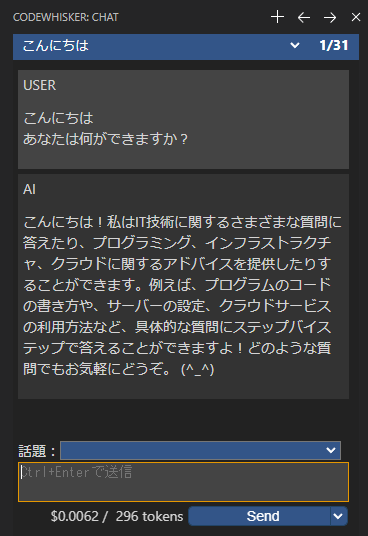

# はじめに
## CodeWhiskerとは何か？

プログラマーの日々の作業をサポートするために開発されたVSCode拡張機能です。  
AIの力を借りて、コードの品質向上を目指し、より効率的な開発を可能にします。

## 特徴

- **AIチャットサポート**: サイドバーからAIとコーディングに関する話題でチャットができます。
- **AIによる評価機能**: 右クリックメニューより、品質向上に役立つ様々な機能を提供します。
  - **レビュー**: コードのレビューをAIに依頼できます。
  - **バグ探索**: 潜在的なバグをAIが探し出します。
  - **説明**: コードの動作についての説明を受けられます。
  - **最適化**: コードの最適化提案を受けられます。
  - **議論**: コードについてAIと議論できます。
  - **テストコード生成**: テストコードの作成をAIに依頼できます。
  - **関数コメント生成**: 選択したテキスト範囲に対する関数コメントをAIが考えます。
  - **翻訳**: 選択したテキストをAIに翻訳してもらえます。
- **対応API**: 以下のAPIが利用可能です。
  - OpenAI
  - Claude3
  - Ollama (ローカルで起動できる言語モデル(LLM)サーバー)

## AIの利用には利用料金がかかります

OpenAIとClaude3のAPIは利用料金がかかります。  
Ollamaはローカルに大規模言語モデルのサーバーを立てるため無料で利用できますが、他の2つと比べると精度が著しく低く、
本格的に利用するには、OpenAIのGPT-4、またはClaude3のsonnet以上のモデルを使用するのがよいでしょう。

# VSCodeのインストール方法

## VSCodeとは
VSCodeはMicrosoftが提供する無料のコードエディタで、多くのプログラミング言語に対応しており、拡張機能も世界中で開発されています。  
様々なサービスがVSCodeに対応しているため、今のソフトウェア開発では必須と呼べるエディタになっています。

## インストール

1. Visual Studio Codeの [公式サイト](https://code.visualstudio.com/) にアクセスします。
2. Downloadページへ遷移して、自分の環境に適したインストーラーをダウンロードします。  
   頻繁にアップデートがあるため、ZIP版よりも自動更新されるインストーラー版を使ったほうがよいでしょう。

## 日本語化

まずは日本語化の拡張機能を入れましょう。VSCodeを起動します。  
サイドバーにある拡張機能のアイコンから、マーケットプレイスを開き、機能を検索してインストール出来ます。  
ここでは「Japanese Language Pack」を入力し、検索結果を選択、インストールを行います。  
インストール後、再起動すると日本語化されます。



# CodeWhiskerのインストール

同様にマーケットプレイスから、「CodeWhisker」を検索しインストールします。


# APIキーの発行

OpenAIとClaude3のAPIの利用には料金がかかります。  
事前にアカウントを作成し、利用料をチャージしておく必要があります。  
そこから利用分だけ消費される従量制になっています。

## OpenAIの場合

### アカウントの作成
1. OpenAIの[API](https://openai.com/api)のページから、Product > API Loginのページへ遷移します。  
   サインアップを選び手順を進めてアカウントを作成してください。

2. ChatGPTかAPIか選択する画面が出た場合は、APIを選びます。

### 支払いの設定
1. アカウントを作成すると、$5分のクレジットがもらえるらしいので、まずはそれを利用しましょう。  

2. クレジットがない場合は、支払いの設定をしてしまいましょう。サイドバーのSettings(歯車アイコン) > Billing画面へ遷移します。  

3. "Payment methods" からクレジットカードの登録を行います。

4. "Add to credit balance"で、クレジットをチャージします。ドルでの支払いになるので注意してください。  
   1000円のつもりで1000と入力しないように！

### APIキーの発行
1. APIキーの発行は、サイドバーのAPI Keys(錠前アイコン) から行います。

2. "+ Create new secret key" を選択して、API KEYを発行します。  
   名前は管理上の名前なので好きに入力してください。  
   ここで発行されたキーは2度と確認することができないので大切に保存してください。  
   

## anthropic(Claude3)の場合

### アカウントの作成

1. anthropicの[API](https://www.anthropic.com/api)のページから、Get started now > ログインページへ遷移します。  
   emailを入力し、手順をすすめてアカウントを作成してください。

### 支払いの設定
1. アカウントを作成すると、評価ユーザーとして$5分のクレジットがもらえるので、まずはそれを利用しましょう。
2. 有料ユーザーになるには、右上のユーザーアイコンから開けるメニューの"Plans & Billing"からプランをビルドプラン以上にアップグレードする必要があります。

### APIキーの発行
1. メニューの"API Keys"から、"Create Key"で発行します。
   発行したキーは2度と確認することができないので大切に保存してください。  

# CodeWhiskerの使い方

## CodeWhiskerの設定

### APIキーの登録(OpenAI / Claudeの場合)
VSCodeを起動して、`CTRL + SHIFT + "P"`キーでコマンドパレットが開けます。  
コマンドパレットからは様々なVSCodeの機能が実行できますが、ここでAPIキーを登録します。  



`CodeWhisker: OpenAI Key` または `Claude API Key`を選択します。  
入力ボックスにAPIキーを登録してください。

### 言語モデルの選択
`CTRL + ","`でVSCodeの設定画面が開きますので、CodeWhiskerと入力してCodeWhiskerの設定を表示します。  
ここで登録したAPIキーに合わせて、利用する言語モデルを指定します。  


### AIとチャットしてみる
VSCodeのサイドバーから、CodeWhiskerを選択するとサイドバーがチャットに切り替わります。  


ここでAIと会話ができます。まずは挨拶してみましょう。  


### チャット以外の機能
エディタの右クリックメニューから、様々な機能が呼び出せます。
  - **レビュー**: コードのレビューをAIに依頼できます。
  - **バグ探索**: 潜在的なバグをAIが探し出します。
  - **説明**: コードの動作についての説明を受けられます。
  - **最適化**: コードの最適化提案を受けられます。
  - **議論**: コードについてAIと議論できます。
  - **テストコード生成**: テストコードの作成をAIに依頼できます。
  - **関数コメント生成**: 選択したテキスト範囲に対する関数コメントをAIが考えます。
  - **翻訳**: 選択したテキストをAIに翻訳してもらえます。


# 利用料(2024/5/1時点) 100万トークンあたり
トークンとは、AIへの指示や、応答のテキストのことです。  
日本語であればほぼ1文字、英語なら数文字という単位になります。  
コストと精度のバランスが最も高いのは、Claude3のSonnetと言われています。

OpenAI
| Model                  | 入力   | 出力    |
|------------------------|-------:|--------:|
| gpt-4-turbo-2024-04-09 | $10.00 |  $30.00 |
| gpt-4-0125-preview     | $10.00 |  $30.00 |
| gpt-4-1106-preview     | $10.00 |  $30.00 |
| gpt-4                  | $30.00 |  $60.00 |
| gpt-4-32k              | $30.00 | $120.00 |
| gpt-3.5-turbo-0125     |  $0.50 |   $1.50 |

Anthropic(Claude)
| Model           | 入力   | 出力    |
|-----------------|-------:|--------:|
| Claude 3 Opus   | $15.00 |  $75.00 |
| Claude 3 Sonnet |  $3.00 |  $15.00 |
| Claude 3 Haiku  |  $0.25 |   $1.25 |

# ローカルLLM実行環境Ollamaの環境構築方法
自分のパソコンにAIモデルをインストールし、それを利用することも可能です。  
CodeWhislerは様々なLLMをローカルで実行できるOllamaというアプリケーションのAPIに対応しています。

ただし、CPUとメモリを大量に消費するため、十分な速度のCPUと、16GBメモリ以上搭載のパソコンが必要になってくると思われます。

また、GPUにも対応していますので、興味があればセットアップにチャレンジしてみてください。

## Ollamaのインストール
[Ollama](https://ollama.com/)のサイトへ行き、Downloadから自分の環境にあったものをダウンロードしてインストールしてください。

## Dockerの場合
Dockerも対応しています。
```
# 起動
$ docker run -d -v ollama:/root/.ollama -p 11434:11434 --name ollama ollama/ollama

# AIモデルのダウンロード、モデル名はphi3 / llamma2 / llama3
$ docker exec -it ollama /bin/bash -c "ollama pull [モデル名]"
```
